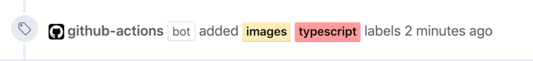
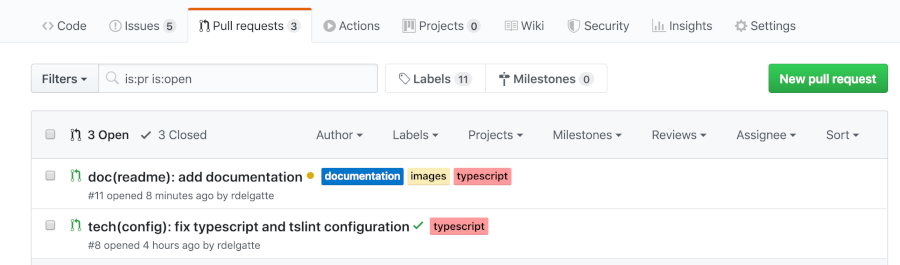

# Github auto-labeler action

GitHub actions to auto label a pull request based on committed files.



When pushing, the action will be triggered and will look for committed files over your branch.
It applies configured labels whenever it find a file whose name matches the associated regular expression.


*Expected result after processing*

<p align="center">
  
</p>

## Startup

### Configuration

Create a file into your root project directory: `.github/label-pr.yml`:
```yaml
- regExp: ".*\\.ts+$"
  labels: ["typescript"]
- regExp: ".*\\.sql+$"
  labels: ["database", "critical"]
- regExp: ".*\\.md+$"
  labels: ["documentation"]
- regExp: ".*\\.(zip|jar|war|ear)+$"
  labels: ["artifact", "invalid"]
```

The configuration is made of a list of `Filter` which are composed of:
- `regExp`: a regular expression which will be tested over the filenames
- `labels`: a list of labels to apply if the filenames match

If the labels do not exist yet in your repository configuration, they will be created anyway.

### Use Github action

Create a file into your root project directory (if it does not exist yet): `.github/main.workflow`:
```
workflow "New workflow" {
  resolves = ["PR label by Files"]
  on = "pull_request"
}

action "PR label by Files" {
  uses = "decathlon/pull-request-labeler-action@v1.0.0"
  secrets = ["GITHUB_TOKEN"]
}

```

When configuring the action, you need to provide the right link into `uses` field here.

## Contributing

- The project is built using [Typescript](https://www.typescriptlang.org/) # `3.5.2`
- We use a [tslint](https://palantir.github.io/tslint/) as a linter for defining code style which configuration may change
- We use [Jest](https://jestjs.io/) as the testing framework

To start, you just need to clone the repository and open it in your favorite IDE.
You may need to set it up so it uses the node configuration (`package.json`) and tslint configuration (`tslint.json`).

### Commands
- To run unit tests: `npm run test:watch`
- To build: `npm run build:main`
